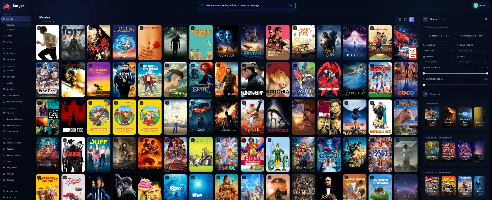

# Scryer

[](https://www.scryer.media/scryer/)

The product website is the source for installation and end-user setup:

- [Scryer website](https://www.scryer.media/scryer/)
- [Scryer getting started](https://www.scryer.media/scryer/docs/getting-started/)

## What Scryer Is

Scryer is a self-hosted media management application for movies, TV series, and anime.

At a high level, it:

- monitors a library and tracked titles
- searches for releases through pluggable providers
- evaluates releases against quality and rules policies
- coordinates downloads and imports
- organizes files for downstream media servers
- manages subtitles

Conceptually it is "Sonarr + Radarr, with some extra bits from other *arr tools"

Scryer was written from scratch and has no affiliation with the Servarr tools.

## Technical Overview

Scryer ships as a single Rust binary with:

- an embedded web UI
- a GraphQL API
- SQLite-backed application state
- a plugin runtime for indexers, download clients, subtitle providers, and notifications

## Architecture

```text
┌─────────────────────────────────────────┐
│  scryer binary                          │
│  ┌───────────┐  ┌────────────────────┐  │
│  │ Web UI    │  │ GraphQL API        │  │
│  └───────────┘  └────────────────────┘  │
│  ┌────────────────────────────────────┐ │
│  │ Application layer                  │ │
│  │ acquisition · import · subtitles   │ │
│  │ rename · post-processing · rules   │ │
│  └────────────────────────────────────┘ │
│  ┌────────────────────────────────────┐ │
│  │ Storage (SQLite) + Plugins         │ │
│  └────────────────────────────────────┘ │
└─────────────────────────────────────────┘
         │                    │
    ┌────┴────┐         ┌─────┴──────┐
    │ Metadata│         │ Indexers & │
    │  API    │         │ Clients    │
    └─────────┘         └────────────┘
```

## Development

- [Contributors guide](CONTRIBUTORS.md)
- [Architecture notes](ARCHITECTURE.md)
- [Issues](https://github.com/scryer-media/scryer/issues)

For installation, upgrade guidance, and end-user documentation, use the website links at the top of this file.

---
*All media images courtesy of [thetvdb](https://thetvdb.com/)*
